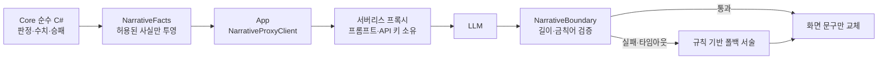

# NOT A NAP : 백일의 밤

> **아기는 당신이 재운 방식을 기억합니다.**
> 첫째 밤과 둘째 밤에 만든 습관이 백일째 밤의 규칙으로 돌아오는, 약 5분 분량의 턴제 육아 로그라이크.

<p align="center">
  <a href="https://seowoo-choi.github.io/not-a-nap/"><b>&#9654;&nbsp; 브라우저에서 바로 플레이</b></a>
  &nbsp;&middot;&nbsp;
  <a href="#ai를-어디에-썼고-어디에-쓰지-않았는가">AI 아키텍처</a>
  &nbsp;&middot;&nbsp;
  <a href="#직접-실행하기">직접 실행하기</a>
</p>

<p align="center">
  <a href="https://github.com/seowoo-choi/not-a-nap/actions/workflows/deploy-webgl.yml"></a>
  
  
  
</p>

설치 없이 브라우저에서 바로 실행됩니다. NHN NAN 2026 해커톤 사전 과제로 제작한 Unity 2D WebGL 게임입니다.

## 무엇이 다른가

아기를 **가장 빨리** 재우는 게임이 아닙니다. 신호를 관찰하고, 가족이 계속 유지할 수 있는 밤 루틴을 만드는 게임입니다.

- **습관이 규칙이 된다** — 반복한 행동은 아기의 기억에 남고, 다음 밤의 판정 규칙 자체를 바꿉니다. 첫날 아기띠에 의존했다면 백일째 밤엔 맨손 눕히기가 더 어려워집니다.
- **정답이 하나가 아니다** — 승리 조건 세 가지 중 두 가지만 만족하면 되고, 도달하는 엔딩은 6종으로 갈립니다.
- **판정과 서술이 분리되어 있다** — 모든 수치·확률·승패는 결정론적 C# 코어가 결정하고, LLM은 밤이 끝난 뒤 육아일지를 쓰는 일만 합니다. ([아래 참조](#ai를-어디에-썼고-어디에-쓰지-않았는가))

## 게임 흐름

| 밤 | 하는 일 |
|---|---|
| **첫째 밤** | 신호를 관찰하고 기본 루틴을 만듭니다. |
| **둘째 밤** | 돌발 상황 속에서 첫날의 선택을 다시 시험합니다. |
| **백일째 밤** | 쌓인 습관이 규칙과 사건으로 돌아오는 최종 밤입니다. |

각 밤은 21:00부터 06:00까지 이어지고, 그 사이 아기는 여러 번 깹니다. 목표는 가장 긴 연속 수면을 만드는 것입니다.

**승리 조건 — 아래 셋 중 둘을 만족하면 됩니다.**

- 아기가 깊은 잠에 든다.
- 보호자 체력을 30 이상 남긴다.
- 아기띠 없이 맨손 눕히기에 성공한다.

### 플레이 요소

- 온도·습도, 기저귀, 배고픔 신호를 살펴보는 교육형 상호작용
- 맨손 안기와 아기띠 착용, 백색소음기, 베이비 모니터 등 선택형 도구
- 수면 중 `같이 쉬기 / 환경 점검 / 다음 수유 준비` 선택
- 기질 3종(순한 아기 · 예민한 아기 · 배고픈 아기)에 따라 달라지는 신호와 반응

## AI를 어디에 썼고, 어디에 쓰지 않았는가

**LLM은 게임을 판정하지 않습니다.** 밤이 끝나면 육아일지 서술을 받기 위해 서버리스 프록시를 **정확히 1회** 호출하고, 응답은 화면 문구만 바꿉니다. 수치·확률·기억·이벤트·승패·엔딩에는 닿지 않습니다.



이 구조가 보장하는 것:

- **API 키가 저장소와 빌드에 없습니다.** 클라이언트가 아는 값은 프록시 URL 하나뿐입니다.
- **프롬프트도 클라이언트에 없습니다.** 게임은 ID와 수치로 된 사실만 보내고, 프롬프트는 프록시가 소유합니다.
- **AI가 죽어도 게임은 굴러갑니다.** 호출 실패·타임아웃·검증 실패는 전부 규칙 기반 폴백 서술로 떨어집니다.
- **되돌아오는 경로가 하나뿐입니다.** 응답이 게임에 반영되는 통로는 `GameSessionPresenter.ApplyNarrative` 단 하나이고, 그 안에서 반드시 `NarrativeBoundary` 검증을 통과합니다. Core와 Presentation 어셈블리는 `noEngineReferences`라 네트워크에 접근할 수조차 없습니다.

자세한 요청·응답 계약은 [인게임 LLM 서술 프록시](docs/narrative-proxy.md)에 있습니다.

## 기술 구성

| 항목 | 내용 |
|---|---|
| 엔진 | Unity `6000.3.20f1` (2D) |
| 언어 | C# |
| 플랫폼 | WebGL — 첫 로딩 약 29MB |
| 테스트 | Unity Test Framework · EditMode 테스트 200개 / 15개 클래스 |
| 배포 | GitHub Actions → GitHub Pages 자동 배포 |
| 규모 | 스크립트 11,445줄 · Core 파일 50개 |

### 설계 원칙

- 판정·수치·확률·승패는 C# Core만 결정합니다. Core에는 MonoBehaviour가 없어 순수 단위 테스트가 가능합니다.
- 같은 입력은 항상 같은 결과를 냅니다. 결정론은 `DeterminismTests`로 강제합니다.
- API 키는 Unity 빌드와 저장소에 포함하지 않습니다.
- WebGL 빌드는 GitHub Pages에서 안정적으로 로드되도록 산출물 정합성을 검사합니다.
- 게임 범위는 아기 1명, 세 번의 밤, 5분 내외 플레이로 제한합니다.

## 프로젝트 구조

```text
Assets/Scripts/Core/          MonoBehaviour 없는 결정론적 게임 규칙
Assets/Scripts/Presentation/  Core와 화면을 연결하는 Presenter·ViewModel
Assets/Scripts/App/           Unity 런타임 UI와 부트스트랩
Assets/Tests/EditMode/        Core·Presentation EditMode 테스트
docs/                         게임 규칙, 화면 명세, 의사결정 기록
proxy/                        서술 생성용 서버리스 프록시
figma-plugin/                 Figma 개발 계약 동기화 플러그인
```

## 직접 실행하기

### 플레이만 해보기

<https://seowoo-choi.github.io/not-a-nap/> — 설치도 로그인도 필요 없습니다.

### 에디터에서 열기

```bash
git clone https://github.com/seowoo-choi/not-a-nap.git
cd not-a-nap
```

Unity Hub에서 프로젝트를 Unity `6000.3.20f1`로 연 뒤 Play 버튼을 누릅니다.

### 테스트 실행

Unity Editor에서 `Window → General → Test Runner → EditMode`를 실행합니다. 명령행에서는 다음과 같이 실행합니다.

```bash
/Applications/Unity/Hub/Editor/6000.3.20f1/Unity.app/Contents/MacOS/Unity \
  -batchmode -nographics \
  -projectPath "$PWD" \
  -runTests -testPlatform EditMode \
  -testResults /tmp/not-a-nap-editmode.xml \
  -logFile /tmp/not-a-nap-editmode.log
```

### 배포

`main` 브랜치에 변경이 병합되면 GitHub Actions가 WebGL을 빌드하고 GitHub Pages에 배포합니다. Unity 라이선스 Secret과 Pages 설정이 먼저 필요합니다. 자세한 내용은 [GitHub Pages 배포 안내](docs/github-pages.md)를 참고하세요.

## 문서

| 문서 | 내용 |
|---|---|
| [게임 코어 설계](docs/vertical-slice-spec.md) | 통잠 루프의 제품 규칙 원본 |
| [백일째 밤 규칙](docs/final-night-spec.md) | 습관이 규칙으로 돌아오는 최종 밤 |
| [화면·상호작용 명세](docs/screen-spec.md) | 화면 구성과 입력 규칙 |
| [인게임 LLM 서술 프록시](docs/narrative-proxy.md) | AI 호출 경계와 요청·응답 계약 |
| [Figma 모바일 개발 계약](docs/figma-mobile-handoff.md) | 디자인-개발 핸드오프 |
| [에셋 출처와 라이선스](docs/assets.md) | 외부 에셋 출처 기록 |
